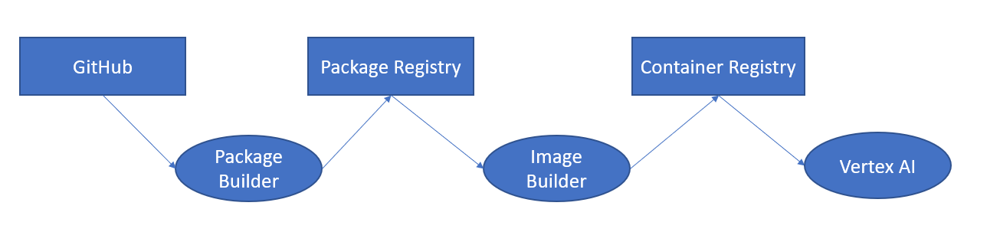

# Using private packages in Vertex AI

---
## Option 1 - Using Prebuilt Containers

Sadly no satisfying solution found, so far 😥

---
## Option 2 - Using Prebuilt Containers

No special treatment for Vertex AI -> 
More general problem: **How to use private python packages in docker images?**

---
## Package Overview

`````shell
structure of package:
├── __init__.py
├── setup.py # or setup.cfg or pyproject.toml
├── my-package
│      └── ...

`````

````python
# setup.py
from setuptools import setup, find_packages

setup(
    name="my-package",
    version="0.1.0",
    description="Test Package",
    author="Laurenz Reitsam",
    python_requires=">=3.7",
    packages=find_packages(),
    install_requires=["sklearn", "tensorflow",
    ]
)
````

---


## Using Google Artifact Registry:



`````text
structure:
├── Dockerfile
├── train.py
├── requirements.txt
`````

#### Create a private python-package registry in GCP

````shell
gcloud artifacts repositories create my-repository \
    --repository-format=python \
    --location=europe-west1 \
    --description="Python package repository"
````

#### push package to registry

````toml
# ~/.pypirc

[distutils]
index-servers =
    my-repository

[my-repository]
repository = <PYTHON-REGISTRY-URL>
````

````shell
pip install twine keyrings.google-artifactregistry-auth

cd my-package

python setup.py sdist bdist_wheel

twine upload --repository-url <PYTHON-REGISTRY-URL> dist/*
````
---
#### reference private registry in project dependencies

`````shell
# requirements.txt
--extra-index-url <PYTHON-REGISTRY-URL>/simple/

my-package
pandas
...
`````

#### install keyrings.google-artifactregistry-auth for automtatic auth
````dockerfile
# Dockerfile
FROM python:3.9-slim

WORKDIR /app
COPY ./train.py .

# this step assures authorization to download packages from private registry
RUN pip install keyrings.google-artifactregistry-auth

# install dependencies
RUN pip install -r requirements.txt
CMD python ./train.py
````

> **NOTE:**
> User must be authorized to access registry

#### build image and push to container registry

````shell
docker build -t <DOCKER-REGISTRY-URL>/test:latest .

docker push <DOCKER-REGISTRY-URL>/test:latest
````

---
## Using GitHub:
SSH access via **project-specific** deploy token


`````text
Structure:
├── Dockerfile
├── train.py
├── requirements.txt
`````

#### add GitHub dependency to requirements.txt

````shell
# requirements.txt
git+ssh://git@github.com/<ORGANISATION>/my-package#egg=my-package
````

#### generating a project specific deploy-token

````shell
ssh-keygen -t rsa -b 4096 -C "test-project-token"  # with default options

cat ~/.ssh/id_rsa.pub
````

Create new deploy-key in your GitHub project: **Repositroy -> Settings -> Deploy keys**

#### use private ssh-key in multi-stage build
````dockerfile
# Dockerfile
FROM python:3.9-slim as builder
ARG SSH_PRIVATE_KEY

RUN apt-get update && apt-get install -y git

RUN mkdir /root/.ssh/ &&  \
    echo "${SSH_PRIVATE_KEY}" > /root/.ssh/id_rsa &&  \
    chmod 400 ~/.ssh/id_rsa && \
    touch /root/.ssh/known_hosts &&  \
    ssh-keyscan github.com >> /root/.ssh/known_hosts

COPY requirements.txt .
RUN pip install -r requirements.txt

#-------------------------------------------------------------------------------------------------
FROM python:3.9-slim

WORKDIR /app
COPY train.py .
COPY --from=builder /usr/local/lib/python3.9/site-packages /usr/local/lib/python3.9/site-packages

CMD python ./train.py
````


````shell
KEY="$(cat ~/.ssh/id_rsa)"

docker build --build-arg SSH_PRIVATE_KEY="$KEY" .
````
